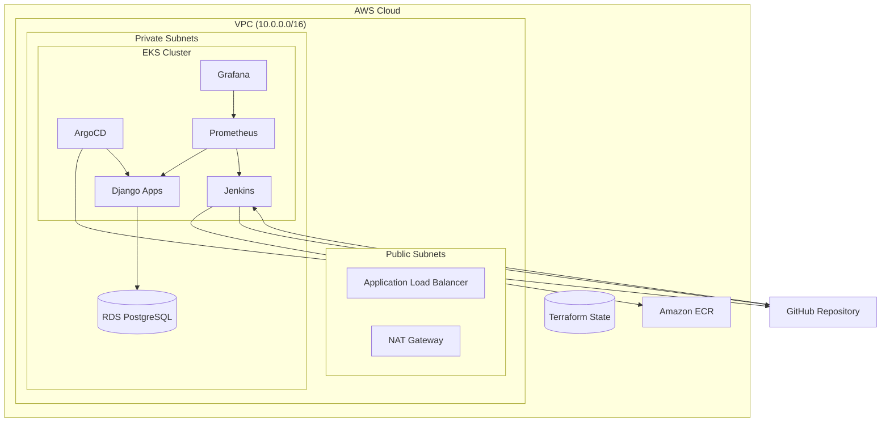

# 🚀 Neo-DevOps: Final Project - Complete CI/CD Infrastructure

[](https://www.terraform.io/)
[](https://kubernetes.io/)
[](https://www.jenkins.io/)
[](https://argoproj.github.io/argo-cd/)
[](https://prometheus.io/)
[](https://www.postgresql.org/)

## 🎯 Огляд Проекту

Цей проект реалізує **production-ready DevOps інфраструктуру** з повним CI/CD pipeline'ом, що включає:

- 🏗️ **Infrastructure as Code** (Terraform)
- 🐳 **Containerized Applications** (Docker + Kubernetes)
- 🔄 **CI/CD Pipeline** (Jenkins)
- 🎯 **GitOps Deployment** (ArgoCD)
- 📊 **Monitoring & Observability** (Prometheus + Grafana)
- 🗄️ **Managed Database** (RDS PostgreSQL)
- 🔐 **Security & Best Practices**

## 🏛️ Архітектура



## 🛠️ Технології

| Компонент | Технологія | Версія |
|-----------|------------|---------|
| **Infrastructure** | Terraform | ~> 5.0 |
| **Container Orchestration** | Amazon EKS | 1.33 |
| **CI/CD** | Jenkins | 2.414.1 |
| **GitOps** | ArgoCD | 2.8.0 |
| **Monitoring** | Prometheus | 25.8.0 |
| **Visualization** | Grafana | 7.0.19 |
| **Database** | PostgreSQL on RDS | 14.19 |
| **Container Registry** | Amazon ECR | - |
| **Application** | Django | 4.2+ |

## 📁 Структура Проекту

```
fp/
├── 📋 README.md                    # Цей файл
├── 📋 README_task.md               # Опис завдання
├── 🏗️ Jenkinsfile                  # CI/CD Pipeline
├── ⚙️ terraform.tfvars             # Змінні Terraform
├── 📄 django-app-argo.yaml         # ArgoCD Application
│
├── 📁 environments/                # Середовища
│   └── dev/                        # Development середовище
│       ├── main.tf                 # Головний конфігураційний файл
│       ├── backend.tf              # Remote state configuration
│       ├── variables.tf            # Змінні середовища
│       ├── outputs.tf              # Виходи ресурсів
│       └── terraform.tfvars        # Значення змінних
│
├── 📁 modules/                     # Terraform модулі
│   ├── vpc/                        # Virtual Private Cloud
│   ├── eks/                        # Elastic Kubernetes Service
│   ├── rds/                        # Relational Database Service
│   ├── ecr/                        # Elastic Container Registry
│   ├── jenkins/                    # Jenkins Helm deployment
│   ├── argo_cd/                    # ArgoCD Helm deployment
│   └── monitoring/                 # Prometheus + Grafana
│
├── 📁 charts/                      # Helm Charts
│   └── django-app/                 # Django application chart
│       ├── Chart.yaml
│       ├── values.yaml
│       └── templates/
│
├── 📁 django/                      # Django application
│   ├── Dockerfile
│   ├── requirements.txt
│   ├── manage.py
│   └── myproject/
│
├── 📁 backend/                     # Terraform Backend Setup
│   ├── main.tf                     # S3 + DynamoDB
│   └── outputs.tf
│
├── 📁 scripts/                     # Utility scripts
│   ├── deploy.sh                   # Deployment script
│   └── cleanup.sh                  # Cleanup script
│
└── 📁 docs/                        # Documentation
    ├── ARCHITECTURE.md
    ├── DEPLOYMENT.md
    └── MONITORING.md
```

## 🚀 Quick Start

### 1. Попередні Вимоги

```bash
# AWS CLI
aws --version
# aws-cli/2.13.0+

# Terraform
terraform --version
# Terraform v1.5.0+

# Kubectl
kubectl version --client
# v1.27.0+

# Helm
helm version
# v3.12.0+

# Docker
docker --version
# Docker version 20.10.0+
```

### 2. Клонування та Налаштування

```bash
# Клонувати репозиторій
git clone <repository-url>
cd fp

# Скопіювати та налаштувати змінні
cp terraform.tfvars.example terraform.tfvars
# Відредагуйте terraform.tfvars з вашими значеннями
```

### 3. Розгортання Backend

```bash
# Створити S3 та DynamoDB для Terraform State
cd backend
terraform init
terraform plan
terraform apply -auto-approve
cd ..
```

### 4. Розгортання Інфраструктури

```bash
cd environments/dev

# Ініціалізація
terraform init

# Планування
terraform plan

# Застосування
terraform apply
```

### 5. Налаштування kubectl

```bash
# Отримати конфігурацію для підключення до EKS
aws eks --region us-east-1 update-kubeconfig \
  --name $(terraform output -raw eks_cluster_name)

# Перевірити підключення
kubectl get nodes
```

## 📊 Доступ до Сервісів

### 🔧 Jenkins

```bash
# Отримати URL Jenkins
kubectl get svc -n jenkins jenkins

# Отримати пароль адміністратора
kubectl get secret -n jenkins jenkins -o jsonpath={.data.jenkins-admin-password} | base64 -d
```

### 🎯 ArgoCD

```bash
# Отримати початковий пароль
kubectl -n argocd get secret argocd-initial-admin-secret \
  -o jsonpath={.data.password} | base64 -d

# Port forward для доступу
kubectl port-forward svc/argocd-server -n argocd 8080:443
# Доступ: https://localhost:8080
```

### 📊 Prometheus

```bash
# Отримати URL
kubectl get svc -n monitoring prometheus-server
# Або через terraform output
terraform output prometheus_url
```

### 📈 Grafana

```bash
# Отримати URL
kubectl get svc -n monitoring grafana
terraform output grafana_url

# Отримати пароль адміністратора
terraform output grafana_admin_password
```

### 🗄️ База Даних

```bash
# Connection string
terraform output database_url
```

## 🔄 CI/CD Pipeline

### Jenkins Pipeline Етапи:

1. **🔍 Checkout**: Отримання коду з Git
2. **🏗️ Build**: Збірка Docker образу
3. **🧪 Test**: Запуск тестів (unit, lint)
4. **📦 Package**: Push образу в ECR
5. **📝 Update**: Оновлення Helm values.yaml
6. **🚀 Deploy**: Commit змін для ArgoCD

### ArgoCD Applications:

- **django-app**: Основний Django застосунок
- **example-app**: Тестовий застосунок
- Автоматична синхронізація з Git репозиторієм

## 📊 Моніторинг

### Prometheus Metrics:
- Kubernetes кластер метрики
- Node metрики (CPU, Memory, Network)
- Pod метрики
- Custom application метрики

### Grafana Dashboards:
- Kubernetes Cluster Overview
- Node Monitoring
- Application Metrics
- Database Monitoring

### Готові Dashboards:
```bash
# Import в Grafana:
# - Kubernetes Cluster Monitoring (ID: 7249)
# - Node Exporter Full (ID: 1860)
# - Django Application Metrics (Custom)
```

## 💰 Вартість

### Приблизна вартість AWS ресурсів (щомісяця):

| Ресурс | Тип | Вартість |
|--------|-----|----------|
| **EKS Control Plane** | - | $73.00 |
| **EC2 Instances** | 2x t3.medium | $60.00 |
| **RDS PostgreSQL** | db.t3.micro | $12.00 |
| **Load Balancers** | 3x ALB | $22.00 |
| **NAT Gateway** | - | $32.00 |
| **EBS Storage** | 40GB | $4.00 |
| **ECR Storage** | <1GB | $1.00 |
| **VPC/Networking** | - | $5.00 |

**💰 Загальна вартість: ~$209/місяць**

> ⚠️ **Примітка**: Вартість може змінюватись залежно від використання та регіону

## 🛡️ Безпека

### Implemented Security Measures:

- ✅ **Network Security**: VPC з приватними підмережами
- ✅ **Access Control**: IAM ролі з мінімальними правами
- ✅ **Secrets Management**: Kubernetes secrets
- ✅ **Database Security**: RDS в приватній мережі
- ✅ **Container Security**: ECR image scanning
- ✅ **Network Policies**: Kubernetes network policies (готово до налаштування)

### Рекомендації:

1. **Rotate Secrets**: Регулярно оновлювати паролі
2. **Monitor Access**: Використовувати CloudTrail для аудиту
3. **Update Dependencies**: Регулярно оновлювати образи та Helm charts
4. **Backup Strategy**: Налаштувати backup для RDS

## 🧪 Тестування

```bash
# Перевірити стан кластера
kubectl get nodes
kubectl get pods --all-namespaces

# Перевірити CI/CD pipeline
# Зробити push в репозиторій та слідкувати за Jenkins job

# Перевірити моніторинг
curl $(terraform output -raw prometheus_url)/api/v1/query?query=up
```

## 📚 Документація

- [📋 Детальна Архітектура](docs/ARCHITECTURE.md)
- [🚀 Інструкції по Деплойменту](docs/DEPLOYMENT.md)
- [📊 Настройка Моніторингу](docs/MONITORING.md)
- [🔧 Troubleshooting Guide](docs/TROUBLESHOOTING.md)

## 🤝 Підтримка

### Якщо виникли проблеми:

1. **Перевірте логи**:
   ```bash
   # Jenkins logs
   kubectl logs -n jenkins -l app.kubernetes.io/name=jenkins
   
   # ArgoCD logs  
   kubectl logs -n argocd -l app.kubernetes.io/name=argocd-server
   
   # Application logs
   kubectl logs -l app=django-app
   ```

2. **Перевірте стан ресурсів**:
   ```bash
   # Terraform state
   terraform show
   
   # Kubernetes resources
   kubectl get all --all-namespaces
   ```

3. **Debugging**:
   ```bash
   # Port forward для локального доступу
   kubectl port-forward svc/jenkins -n jenkins 8080:8080
   ```
